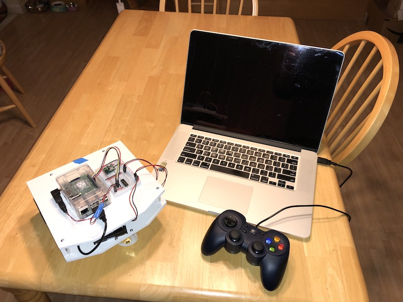
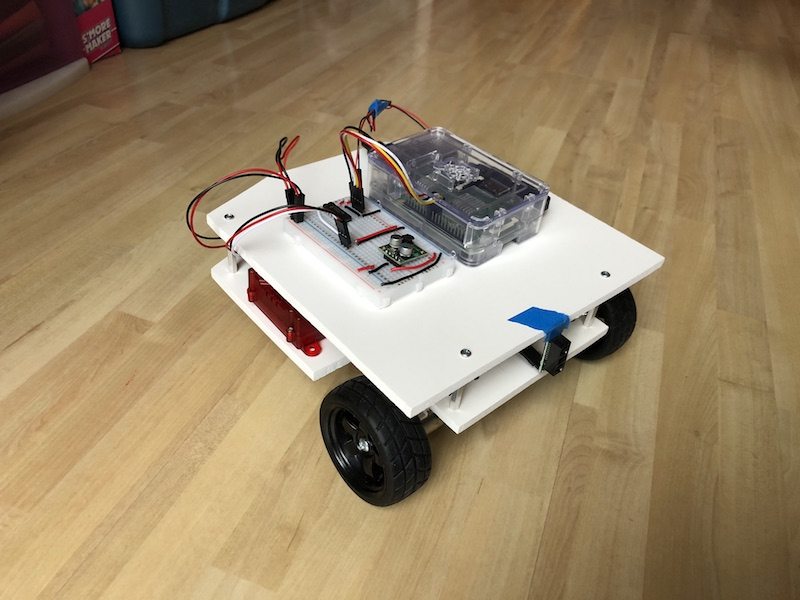
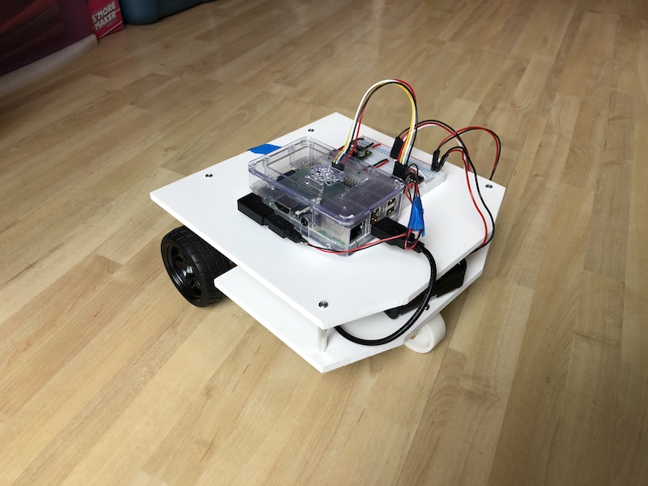
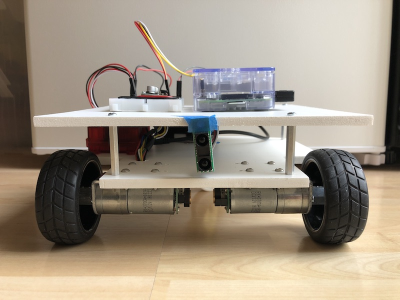
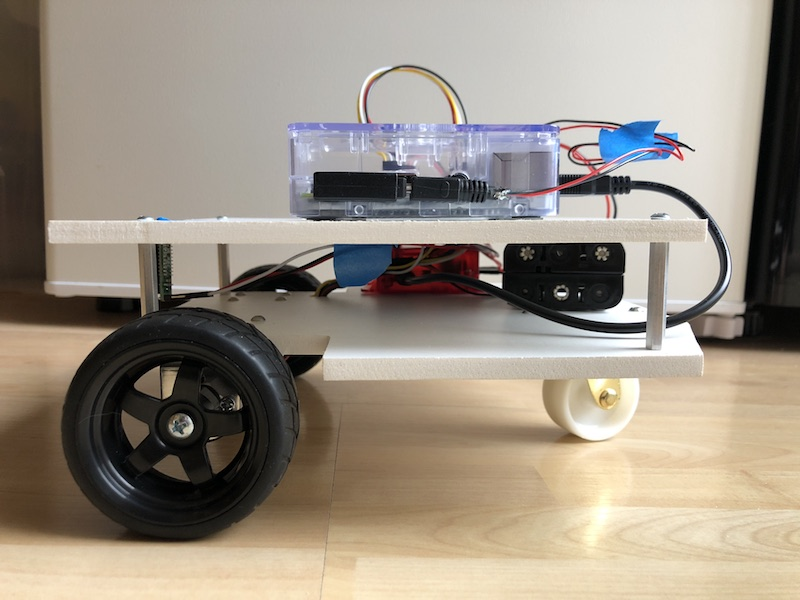
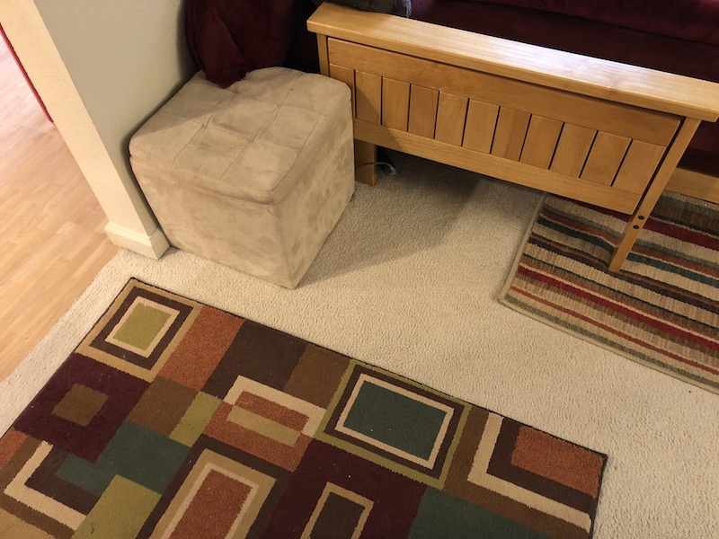

# B2 - Hide & Seek Robot
#### ...and more importantly, an educational platform for me, my kids, and my friends.

### *This project is not yet complete*

This is my ROS project consisting of the custom code for my robot named **B2**.

B2 is a 2-wheel differential drive robot. Its initial design goal is to create a hide & seek robot that will roam a single floor in a multi-room house looking for a person who is hiding. This goal was suggested by my elementary school-age kids when I was searching for a goal for which to build a robot from scratch.

My oldest daughter picked the name **B2**. Prior to this robot, we build a light-follower robot partially following [a design](http://www.robotoid.com/my-first-robot/rbb-bot-phase2-part1.html) from the author of [Robot Builder's Bonanza](http://amzn.to/2vk4dpO). That first robot she named Beddo, from a [scene in Despicable Me 2](https://youtu.be/htcQ6CIKqGg?t=1m6s). Therefore she wanted this robot to be named **B2**.

### The Initial Design

First, I modeled the robot in Fusion 360. Doing so allowed me to quickly think through and experiment with many of the physical design ideas I had in my mind. It also allowed me to build a list of parts I would need. Many of the parts I was considering had existing CAD models that I could import into Fusion 360 such as the motors, wheels, and IR sensors, etc. The design changed many times as I worked on the model. For example, at first I forgot to include a battery. When I added a 7.2v R/C battery to the model, I realized I needed a 2nd level to have more room to place some of the components.

| Initial Fusion 360 design|
|---|

### Building the Drive Base

Then I built the lower level which contained the drive system. I sourced parts from Pololu, Mouser, Amazon.com, and the local Ace Hardware store.

Pololu had a big sale during Black Friday 2017, so I picked up a bunch of parts during that sale, including a [Roboclaw 2x7A motor controller](https://www.pololu.com/product/3284). This is the red box on the lower shelf in the design picture above. 

This turned out to be a great move for me, because my alternative was to use an Arduino as the controller. But the Roboclaw has far more capability, works great, and with the Pololu sale was about the same price as an Arduino Uno board. I had already researched and figured out the math to implement a PID controller, but it saved me a lot of time (i.e. nights & weekends) not having to code and debug one of those.

Some pages that helped me understand PID Controllers:

* [Wikipedia: PID Controller](https://en.wikipedia.org/wiki/PID_controller)
* [Good intro to PID controllers by Andrew Kramer](http://andrewjkramer.net/pid-motor-control/)

### Integrating the Drive Base into ROS

After getting the Roboclaw working with the drive motors, I started looking for an existing ROS node to drive the Roboclaw from a Raspberry PI 3 (the grey box pictured on the top shelf above). After searching through the ROS projects I could find that worked with the Roboclaw, I decided to create my own.

[https://github.com/sheaffej/roboclaw_driver](https://github.com/sheaffej/roboclaw_driver)

Once I could control the Roboclaw as a ROS node, I created a basic ROS node fr the base (`base_node`), and a joystick teleoperation node (`teleop_node`) to manually drive the robot around. 

The `teleop_node` was very straight forward. 

However the `base_node` required me to learn about robot kinematics, some linear algebra, and refresh my memory of trigonometry.

### Leaning Kinematics, Linear Algebra, and Odometry

Below are some pages that really helped me understand kinematics, linear algebra, and odometry calculations. I read through many dozens of pages on the web, and the ones listed below were those that really stood out for me, and that I referred back to many times as my knowlege grew.

This paper below by Columbia University helped me understand the fundamental math of Forward and Inverse Kinematics. This introduced me to several terms that I would need to use, but the math here was too far removed from my specific scenario. So I ended up using different equations which are mentioned further below.

* [http://www8.cs.umu.se/kurser/5DV122/HT13/material/Hellstrom-ForwardKinematics.pdf](http://www.cs.columbia.edu/~allen/F17/NOTES/icckinematics.pdf)

These videos below helped me understand how the equations for control and odometry were derived. I ended up using different equations (see Christoph Rösmann's answer below), but seeing how the equations were derived and work together helped me visualize the concepts behind the equations, which allowed me to understand the other variants of equations I found on the web:

* [(YouTube) Georgia Tech: Control of Mobile Robots- 2.2 Differential Drive Robots](https://youtu.be/aE7RQNhwnPQ)
* [(YouTube) Georgia Tech: Control of Mobile Robots- 2.3 Odometry](https://youtu.be/XbXhA4k7Ur8)

I found this page filled in a lot of gaps for me, specifically related to why the ROS calculations looked different from the kinematic calculations used in non-ROS applications. Spoiler Alert: ROS calculates angular velocity from the center of the robot, where most kinematics papers calculate it from the ICC off the left side. That changes what the equations simplify to, and therefore makes the equations look slightly different.

* [http://robotsforroboticists.com/drive-kinematics/](http://robotsforroboticists.com/drive-kinematics/)

Ultimately, to understand how to calculate odometry I needed to learn some linear algebra. I had managed to avoid learning linear algebra in my undergrad and grad school, so I needed to learn it now. I will say that having a real-world problem to solve when learning math concepts makes a HUGE difference. Having my odometry problem to solve, and these really great videos below, I was able to learn what I needed about linear algebra pretty quickly. I only needed to watch up to video #6 which deals with 3D transformations.

* [YouTube playlist: Essence of linear algebra](https://www.youtube.com/playlist?list=PLZHQObOWTQDPD3MizzM2xVFitgF8hE_ab)

In the end, the equations and libraries I used to calculate odometry have the linear algebra "baked in", so my implementation didn't need to perform the math myself. However having studied the concepts, I felt confident that I understood what the equations and libraries were doing. It also made it much easier to catch a few bugs in my initial implementation since I could actually understand things like what a Quarternion vs. Euler was, and why/how you need to convert between them.

This answer below by Christoph Rösmann ultimately was the template I used for my odometry calculations. I came across this page early on during my research, and it made very little sense to me at that time. But then after studying the other topics above, when I stumbled on this page again this answer really pulled it all together for me.

* [https://answers.ros.org/question/231942/computing-odometry-from-two-velocities/](https://answers.ros.org/question/231942/computing-odometry-from-two-velocities/)

### From Teleoperation to Autonomy

| B2's teleoperation setup|
|---|

Having the `base_node` drive control and odometry logic sorted out, and tested using teleoperation, I moved on to building B2's ability to sense its environment.

At first, B2 would simply use IR sensors to detect proximity to walls and other obstacles. This should be sufficient for its main goal as a hide & seek game robot. 

However, B2 doesn't really need odometry for that. So why did I put the effort into learning how to calculate odometry? Because my plan is to extend B2 beyond its original goal of hide & seek to do more interesting things around the house. For this B2 will need better sensors, and an ability to localize itself within the house. But that's a later goal.

When Pololu had its Black Friday 2017 sale, I also picked up four [Sharp GP2Y0A60SZLF](https://www.pololu.com/product/2474) IR sensors. These are analog sensors, so their output is an analog signal representing the distance to an object, not a digital signal. And since I used the Roboclaw instead of an Arduino, and the Raspberry PI 3 does not have any Analog-to-Digital Converters (ADCs) I needed a way to convert the analog signal to a digital one so it could be interpreted by a ROS node to send messages to the other parts of B2.

I found this great article by Adafruit that covered exactly what I needed:

* [https://learn.adafruit.com/raspberry-pi-analog-to-digital-converters/mcp3008](https://learn.adafruit.com/raspberry-pi-analog-to-digital-converters/mcp3008)

Originally, I wanted to attempt to use the IR sensors to measure distance. But after wiring them up and testing them, I realized the output voltage curve is too exponential to be reliable as a measuring sensor. The voltage changes quickly as an object moves near the sensor, but if the object is at distance the voltage changes are very minor even for large distance changes. Therefore, I accepted that I must only use them as proximity sensors.

I created a ROS node (`sensors_node`) to read the output of the ADC chip over SPI from the Raspberry PI's GPIO pins. It compares the ADC value to a threshold calculated from a distance goal. And it publishes the state of the proximity sensors as simply True or False, where True means there is an object in proximity.

Below is what B2 looks like on 10 Mar 2018.

| Front-Right| Rear-Left|
|----|----|

| Front| Left Side|
|----|----|

In the original design, I planned to have the drive wheels in the rear with the caster in the front (a RWD robot). You can see that in the Fusion 360 design where I made a stylistic bevel to the front edge (caster side) and left the rear edges square. My idea was that if the caster hit an obstacle on the floor, the resistance would cause more pressure on the rear wheels, thus providing more traction for the drive wheels allowing it to drive over the obstacle.

But when testing using the joystick and `teleop_node` I realized the caster gets stuck on our thicker area rugs and the rear wheel just spin without traction. However if I drove B2 in reverse over the carpet, it climbed right over the rug with no problems. Therefore B2 is now a FWD robot!

| Area rugs: B2's archenemy|
|---|

**Lesson learned:** If you aren't yet sure how your robot will work, don't spend much time on cosmetic design. Else it might end up driving backwards like B2 does now.

